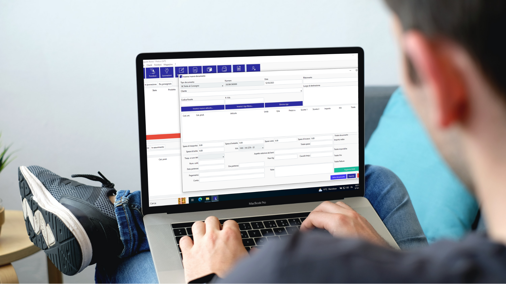

# Labor 1
## Il gestionale semplice fatto proprio per te!
### Introduzione
Labor1 è un software gestionale completo progettato per semplificare la gestione dei cen
tri assistenza tecnica.

Il software è stato progettato per aiutar ti a migliorare l'efficienza e la produttività del tuo centro,
automatizzando i processi di gestione con un interfaccia pratica, fresca e intuitiva
Con Labor1, i centri assistenza possono facilmente gestire le richieste di assistenza e tracciare lo stato degli
interventi. 

Il software dispone di una vasta gamma di funzionalità, tra cui:
- Gestione delle richieste di assistenza: Labor1 consente ai centri assistenza di ges tire le richieste di
assistenza in modo efficiente, dalla registrazione delle richieste di assistenza alla pianificazione degli
interventi e alla gestione del personale assegnato alle attività.

- Tracciamento degli interventi: Labor1 ti permette di tracciare g li interventi in corso e quelli
completati, fornendo informazioni dettagliate sulle attività svolte e sui tempi di esecuzione.

- Elaborazione rapportini: Labor1 ti permette di tenere traccia degli spostamenti dei tuoi tecnici e
de gli interventi portati a termine.

- Stampe report: Labor 1 produce, in una veste semplice e chiara, report, documenti di
moviment azione merci e prese in carico di prodotti.

- Gestione clienti: Con Labor 1 potrai sempre avere a portata di click il tuo portafoglio clienti con
contatti, informazioni e storia di ogni singolo cliente.

Il software Labor1 è altamente personalizzabile e può essere adattato alle esigenze specifiche di ogni centro
assistenza. Inoltre, Labor1 è facile da usare, grazie a d un interfaccia chiara, intuiti va e votata all a praticità
anche in situazioni che richiedono la massima velocità.
In fine potrai permettere a tutti i tuoi collaboratori di seguire lo stato delle lavorazioni e degli interventi sul
proprio PC accedendo al database dalla tua rete locale.                                                                                     

